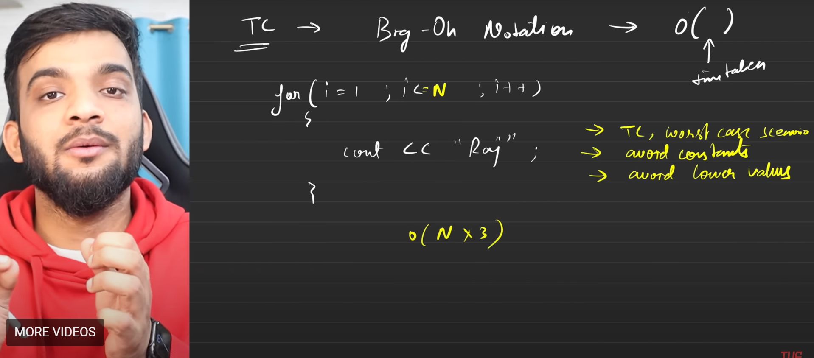

Mind maps:

0. User Input/output -- this can be easily done with the js functions -- using readline
1. Data types
2. If else statements
3. Switch statements
4. Intro to arrays and strings
5. For loops
6. While loops
7. Functions
8. Time complexity and space complexity \*important:

- Three rules while calculating the time complexity
- Big O, theta, omega

- Space complexity: Auxilary and Input space
